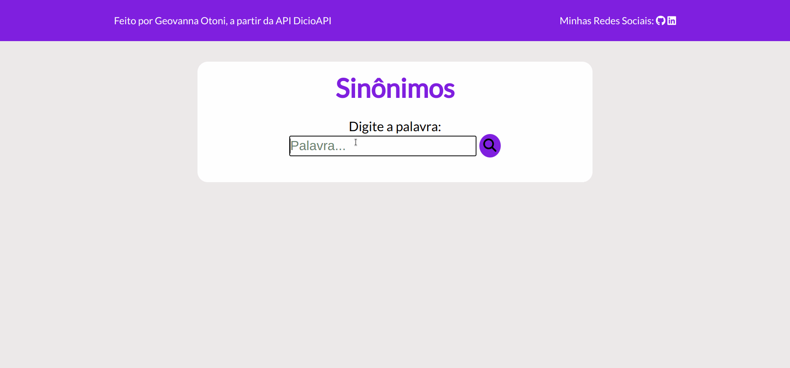

# Sinônimos
Projeto Pessoal de um aplicação que exibe alguns sinônimos da língua portuguesa da palavra pesquisada pela pessoa usuária, a partir da API DicioAPI. Também foram utilizadas as bibliotecas NPM Clipboard Copy para a pessoa usuária poder copiar o sinônimo para a área de transferência e SweetAlert para alertar que a palavra foi copiada com sucesso.  

## :computer: Visualize este projeto:
Acesse a página aqui:
[https://geovannaotoni-sinonimos.surge.sh/](https://geovannaotoni-sinonimos.surge.sh/)

## :bulb: Habilidades:
Feito a partir dos conhecimentos de CSS, HTML, JavaScript, DOM, Eventos, API, NPM, Vite, Promisses, Fetch, Async e Await.